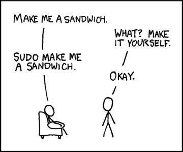

# Command Line Basics


*Taken from XKCD*

Before writing firmware, you will need to know how to interact with your computer using the command line interface (CLI). Whether you are on Windows, macOS, or Linux, the terminal is how we communicate directly with the ESP-IDF environment to compile and flash our code. For the purposes of this reading, we will be showing the Git Bash terminal, which mimics a Unix-based environment.

## Understanding the CLI
When opening Git Bash (or another terminal), you may see something like this in the terminal (also in the screenshot above!):

```bash
(env) oski@stolerpi:~
$
```
`(env)` = environment <br> 
`oski` = username <br>
`stolerpi` = machine's host name <br>
`~` = location in your file system (in this case the home folder) <br>
`$` = a prompt character letting you know that it's ready for a command depending on your shell (`$` is the default in bash, `%` is the default in zsh)

## Navigating Folders
Okay we've opened the terminal, so what? We need to be able to move around and access specific folders. In a Unix-base CLI, you can navigate folders using these commands:
 
```bash
pwd                  # "print working directory" -- outputs your exact location
ls                   # displays all files and folders in your current directory
ls -a                # the -a flag lets you see hidden files and file sizes
cd                   # "change directory" -- moves you to a different folder
```

## Understanding Paths
To move between folders or run specific files, you need to provide the correct path.

**Absolute Paths:** This is the full address starting from the root of your computer (e.g. `/home/user/esp/` or `C:\Users\Name\esp\`). An absolute path works no matter where you currently are in the terminal.

**Relative Paths:** This address starts from your current location. If you are inside `/home/user/` and want to go to the `esp` folder, you just type `cd esp`.

**Example:** `projects/hello_world` (only works if you're already in `/home/oski`)
`~` is a shortcut for your home folder (`/home/yourname`), so `~/projects` and `/home/oski/projects` are the same thing.

There are also a few universal shortcuts that are constantly used (and can `cd` to):

`.` (dot): represents your current folder. <br>
`..` (double dot): represents the parent folder (one level up). Typing `cd ..` moves you backward. <br>
`~` (tilde): represents your personal home directory. <br>

## Moving around
You can not only move around different folders, you can also move folders and files yourself! Below are some commands on how to manipulate files:

```bash
mkdir myfolder          # create a new folder
cp notes.txt backup.txt # copy a file
mv notes.txt docs/      # move a file into a folder
mv notes.txt new.txt    # rename a file (move and rename are the same command)
rm old.txt              # delete a file — no trash bin, this is permanent
rm -r myfolder          # delete a folder and everything inside it
```
 
## Useful shortcuts
```bash
Ctrl + C             # terminates process (program) that is running
Ctrl + D             # log out of the session
Up arrow             # cycle through previous commands — saves a lot of retyping
Tab                  # autocomplete a filename or command
clear                # clear the screen
```
 
## Getting help
 
If you're not sure what a command does, two options:
 
```bash
man ls               # opens the full manual page for a command — q to quit
ls --help            # shorter built-in help, works for most commands
```

## Running Scripts and ESP-IDF Tools
The primary reason we use the terminal is to execute setup scripts and the ESP-IDF build system. We will go over this in more detail in a later section but just know that's why the CLI is important!
