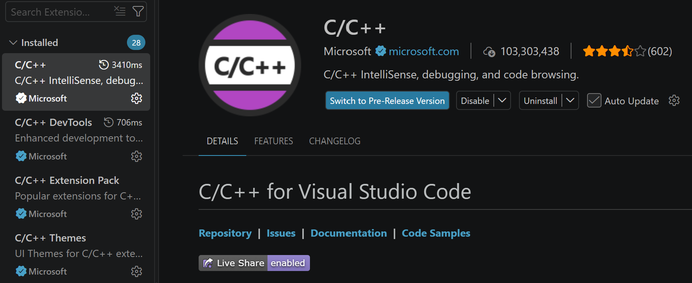

# C Basics

## Installing C
We actually don't need to have C installed on your local system due to ESP-IDF having its own specialized C compiler in the background.

Thus the only setup for C that we have to do is to add the extension on VSCode which you can do by searching up C/C++ in the extensions tab.



<div style="padding: 2px 16px; background-color: #705337; border-radius: 6px;">
<h3><b>Exercise 🎯:</b> Download the C/C++ VSCode extension.</h3> 
</div>

## What is C?

C is a programming language commonly used for **embedded systems** and **microcontrollers**.
Unlike higher-level programming languages, C allows us to work closely with the hardware.

For example, C can be used to:
- Read sensors
- Control GPIO pins
- Communicate using CAN
- Control motors
- Generate PWM signals
- Configure hardware timers
- Communicate using I2C, SPI, and UART
- Control an ESP32
Throughout this training, we will use C to write firmware for our microcontrollers.

## Hello World

A basic C program looks like this:

```c
#include <stdio.h>

int main(void)
{
    printf("Hello World!\n");

    return 0;
}
```

When this program runs, it prints:

```text
Hello World!
```

Let's break down what each part means.

### `#include`
<details>
<summary> #include </summary>

```c
#include <stdio.h>
```

`#include` allows us to use code from another library.

`stdio.h` stands for:

```text
Standard Input / Output
```

It gives us access to functions such as:

```c
printf();
```

which allows us to print information to the terminal.

</details>

### The `main()` Function
<details>
<summary> The main() Function </summary>

```c
int main(void)
{
    
}
```

`main()` is where a normal C program begins executing.

Everything inside the `{ }` belongs to the function.

For example:

```c
int main(void)
{
    printf("Hello!\n");

    return 0;
}
```

The computer executes the program starting from the first statement inside `main()`.

</details>

---

## Variables
Variables allow us to store information.

<details>
<summary>Using variables</summary>

For example:

```c
int speed = 50;
```

This creates a variable named:

```text
speed
```

and gives it the value:

```text
50
```

We can later change it:

```c
speed = 75;
```
</details>

## Data Types
C requires us to specify what type of information a variable stores.

<details>
<summary>Basic data types</summary>

Some common types are:

| Type | Description | Example |
|---|---|---|
| `int` | Whole number | `25` |
| `float` | Decimal number | `3.14` |
| `double` | Higher precision decimal | `3.141592` |
| `char` | Single character | `'A'` |
| `bool` | True or false | `true` |

Examples:

```c
int speed = 50;

float voltage = 12.5;

char letter = 'A';
```

To use `bool`, include:

```c
#include <stdbool.h>
```

Then we can write:

```c
bool motor_running = true;
```
</details>

## Printing Variables
We can use `printf()` to print variables.

<details>
<summary>How to print variables</summary>

For an integer:

```c
#include <stdio.h>

int main(void)
{
    int speed = 50;

    printf("Speed: %d\n", speed);

    return 0;
}
```

Output:

```text
Speed: 50
```

`%d` tells `printf()` that we want to print an integer.

Some common formatting symbols are:

| Symbol | Type |
|---|---|
| `%d` | Integer |
| `%f` | Float |
| `%c` | Character |
| `%s` | String |

Example:

```c
int temperature = 85;

printf("Temperature: %d\n", temperature);
```
    
</details>

## Arithmetic Operators
C can perform normal mathematical operations.

<details>
<summary>Using arithmetic operators in C</summary>

```c
int a = 10;
int b = 5;

int addition = a + b;
int subtraction = a - b;
int multiplication = a * b;
int division = a / b;
```

The main arithmetic operators are:

| Operator | Meaning |
|---|---|
| `+` | Addition |
| `-` | Subtraction |
| `*` | Multiplication |
| `/` | Division |
| `%` | Remainder |

For example:

```c
int value = 10 % 3;
```

The result is:

```text
1
```

because:

```text
10 / 3 = 3 remainder 1
```
    
</details>


## Comparison Operators
Comparison operators allow us to compare values.

<details>
<summary>Using comparison operators in C</summary>

| Operator | Meaning |
|---|---|
| `==` | Equal to |
| `!=` | Not equal to |
| `>` | Greater than |
| `<` | Less than |
| `>=` | Greater than or equal to |
| `<=` | Less than or equal to |

For example:

```c
speed > 50
```

checks whether `speed` is greater than `50`.

Be careful with:

```c
=
```

and:

```c
==
```

They mean different things.

`=` assigns a value:

```c
speed = 50;
```

`==` compares two values:

```c
speed == 50
```
    
</details>

## Conditionals
Conditionals enable us to control where our code goes based on different states and inputs.

#### `if` statements
<details>
<summary>if</summary>

An `if` statement allows the program to make decisions.

```c
int temperature = 100;

if (temperature > 90)
{
    printf("Temperature is high!\n");
}
```

The code inside the `{ }` only runs if the condition is true.
    
</details>

#### `if`/`else`
<details>
<summary> if/else</summary>

We can also provide another action if the condition is false.

```c
int temperature = 70;

if (temperature > 90)
{
    printf("Temperature is high!\n");
}
else
{
    printf("Temperature is normal.\n");
}
```
    
</details>

#### `else if`
<details>
<summary>else if</summary>

We can check multiple conditions:

```c
int temperature = 85;

if (temperature > 100)
{
    printf("Temperature is too high!\n");
}
else if (temperature > 80)
{
    printf("Temperature is warm.\n");
}
else
{
    printf("Temperature is normal.\n");
}
```
    
</details>

## Logical Operators
Logical operators let us check multiple conditionals at once.

<details>
<summary>Logical Operators</summary>

The most common logical operators are:

| Operator | Meaning |
|---|---|
| `&&` | AND |
| `||` | OR |
| `!` | NOT |

For example:

```c
if (temperature > 80 && temperature < 100)
{
    printf("Temperature is within range.\n");
}
```

Both conditions must be true because we used:

```c
&&
```
    
</details>

## Loops

Loops allow us to repeat code.

Two important loops in C are:

- `for`
- `while`

#### `for` Loop
<details>
<summary>for loop</summary>

A `for` loop repeats code a specific number of times.

```c
for (int i = 0; i < 5; i++)
{
    printf("%d\n", i);
}
```

Output:

```text
0
1
2
3
4
```

The variable `i` increases by one after every loop.

This:

```c
i++;
```

is equivalent to:

```c
i = i + 1;
```
    
</details>

#### `while` Loop
<details>
<summary>while loop</summary>

A `while` loop continues running while a condition is true.

```c
int count = 0;

while (count < 5)
{
    printf("%d\n", count);

    count++;
}
```

Output:

```text
0
1
2
3
4
```
    
</details>


#### Infinite Loops
<details>
<summary>Infinite Loops</summary>

Embedded systems commonly use infinite loops.

For example:

```c
while (1)
{
    printf("Running...\n");
}
```

Because `1` represents true, this loop runs forever.

You will see this pattern often in embedded programming.

Conceptually, a microcontroller might do:

```c
while (1)
{
    read_sensor();

    process_data();

    control_motor();
}
```

The microcontroller continuously performs its tasks until power is removed or the system is reset.
    
</details>

## Functions

Functions allow us to organize and reuse code.

<details>
<summary>Functions</summary>

Instead of writing the same code repeatedly, we can put it inside a function.

Example:

```c
#include <stdio.h>

void say_hello(void)
{
    printf("Hello!\n");
}

int main(void)
{
    say_hello();

    say_hello();

    return 0;
}
```

Output:

```text
Hello!
Hello!
```

</details>

#### Function Parameters

<details>
<summary>Function Parameters</summary>

Functions can also receive information.

```c
void print_speed(int speed)
{
    printf("Speed: %d\n", speed);
}
```

We can call it using:

```c
print_speed(50);
```

Output:

```text
Speed: 50
```
    
</details>

#### Functions That Return Values
<details>
<summary>Functions That Return Values</summary>

Functions can also calculate and return a value.

```c
int add(int a, int b)
{
    return a + b;
}
```

We can use the function like this:

```c
int result = add(5, 10);

printf("%d\n", result);
```

Output:

```text
15
```
    
</details>

## Arrays

Arrays allow us to store multiple values of the same type.

<details>
<summary>Arrays</summary>

For example:

```c
int temperatures[5] = {70, 72, 75, 78, 80};
```

Each value has an **index**.

```text
Index:       0   1   2   3   4
Value:      70  72  75  78  80
```

Notice that array indexing begins at:

```text
0
```

To access the first value:

```c
temperatures[0]
```

To access the third value:

```c
temperatures[2]
```

Example:

```c
printf("%d\n", temperatures[2]);
```

Output:

```text
75
```
    
</details>

## Comments

Comments allow us to leave notes inside our code.

<details>
<summary>How to use comments</summary>

A single-line comment uses:

```c
// This is a comment
```

For example:

```c
int speed = 50; // Motor speed
```

A multi-line comment uses:

```c
/*
 * This is a
 * multi-line comment.
 */
```

Comments are ignored by the compiler.

</details>

## Example Program

Let's combine some of the concepts we just learned.

```c
#include <stdio.h>

void check_temperature(int temperature)
{
    if (temperature > 100)
    {
        printf("WARNING: Temperature is too high!\n");
    }
    else if (temperature > 80)
    {
        printf("Temperature is warm.\n");
    }
    else
    {
        printf("Temperature is normal.\n");
    }
}

int main(void)
{
    int temperatures[5] = {70, 85, 95, 105, 75};

    for (int i = 0; i < 5; i++)
    {
        printf("Temperature: %d\n", temperatures[i]);

        check_temperature(temperatures[i]);
    }

    return 0;
}
```

This example uses:

- Variables
- Arrays
- Functions
- `for` loops
- `if` statements
- Comparisons
- `printf()`

These concepts will appear frequently throughout the rest of the firmware training.


## Exercise 1v1 - C Basics
[https://www.onlinegdb.com/online_c_compiler](https://www.onlinegdb.com/online_c_compiler)

Will have to download the C/C++ extension in VSCode.

Start with the following program:

```c
#include <stdio.h>

int main(void)
{
    int temperature = 75;

    printf("Temperature: %d\n", temperature);

    return 0;
}
```

<div style="padding: 2px 16px; background-color: #705337; border-radius: 6px;">
<h3>🎯 <b>TASK 1:</b> Change the temperature variable to 100 and run the program.</h3>
</div>

<br>
Your output should look something like:

```text
Temperature: 100
```

<div style="padding: 2px 16px; background-color: #705337; border-radius: 6px;">
<h3>🎯 <b>TASK 2:</b> Use an if statement to print a warning when the temperature is greater than 90.</h3>
</div>

<br>

Next, add an `if` statement that prints a warning if the temperature is greater than `90`.

Your output should look something like:

```text
Temperature: 100
WARNING: Temperature is too high!
```

<div style="padding: 2px 16px; background-color: #705337; border-radius: 6px;">
<h3>🎯 <b>TASK 3:</b> Create a for loop that prints the numbers 0 through 9.</h3>
</div>

<br>

Next, create a `for` loop that prints the numbers `0` through `9`.

Expected output:

```text
0
1
2
3
4
5
6
7
8
9
```

<div style="padding: 2px 16px; background-color: #705337; border-radius: 6px;">
<h3>🎯 <b>TASK 4:</b> Create and call the print_temperature() function.</h3>
</div>

Finally, create a function called:

```c
void print_temperature(int temperature)
```

The function should print:

```text
Current Temperature: 75
```

when called using:

```c
print_temperature(75);
```
---

# Answer Key

Try completing all of the exercises on your own before looking at the solutions below.

<details>
<summary><b>Click here to reveal the answers</b></summary>

<br>

## Task 1 - Change the Temperature Variable

The original program was:

```c
#include <stdio.h>

int main(void)
{
    int temperature = 75;

    printf("Temperature: %d\n", temperature);

    return 0;
}
```

You can change `temperature` to any integer value.

For example:

```c
#include <stdio.h>

int main(void)
{
    int temperature = 100;

    printf("Temperature: %d\n", temperature);

    return 0;
}
```

### Output

```text
Temperature: 100
```

The important part is understanding that:

```c
int temperature = 100;
```

creates an integer variable named `temperature` and stores the value `100` inside it.

---

## Task 2 - Temperature Warning

The goal was to print a warning whenever the temperature is greater than `90`.

One solution is:

```c
#include <stdio.h>

int main(void)
{
    int temperature = 100;

    printf("Temperature: %d\n", temperature);

    if (temperature > 90)
    {
        printf("WARNING: Temperature is too high!\n");
    }

    return 0;
}
```

### Output

```text
Temperature: 100
WARNING: Temperature is too high!
```

If we change:

```c
int temperature = 100;
```

to:

```c
int temperature = 75;
```

the output becomes:

```text
Temperature: 75
```

The warning does not appear because:

```c
temperature > 90
```

is false.

### Bonus Solution

You could also use an `else` statement:

```c
#include <stdio.h>

int main(void)
{
    int temperature = 75;

    printf("Temperature: %d\n", temperature);

    if (temperature > 90)
    {
        printf("WARNING: Temperature is too high!\n");
    }
    else
    {
        printf("Temperature is normal.\n");
    }

    return 0;
}
```

---

## Task 3 - For Loop

The goal was to print the numbers `0` through `9`.

One solution is:

```c
#include <stdio.h>

int main(void)
{
    for (int i = 0; i < 10; i++)
    {
        printf("%d\n", i);
    }

    return 0;
}
```

### Output

```text
0
1
2
3
4
5
6
7
8
9
```

The loop:

```c
for (int i = 0; i < 10; i++)
```

can be broken into three parts:

```text
int i = 0
```

Starts `i` at `0`.

```text
i < 10
```

Keeps running the loop while `i` is less than `10`.

```text
i++
```

Increases `i` by `1` after each loop.

So the value of `i` changes like:

```text
0 → 1 → 2 → 3 → 4 → 5 → 6 → 7 → 8 → 9
```

Once `i` becomes `10`, the condition:

```c
i < 10
```

is false and the loop stops.

---

## Task 4 - Creating a Function

The goal was to create the function:

```c
void print_temperature(int temperature)
```

and call it using:

```c
print_temperature(75);
```

One solution is:

```c
#include <stdio.h>

void print_temperature(int temperature)
{
    printf("Current Temperature: %d\n", temperature);
}

int main(void)
{
    print_temperature(75);

    return 0;
}
```

### Output

```text
Current Temperature: 75
```

The function:

```c
void print_temperature(int temperature)
```

takes an integer as an input.

When we write:

```c
print_temperature(75);
```

the value `75` is passed into the function and stored in the parameter:

```c
temperature
```

We could also call the function multiple times:

```c
print_temperature(75);
print_temperature(90);
print_temperature(105);
```

### Output

```text
Current Temperature: 75
Current Temperature: 90
Current Temperature: 105
```

---

# Complete Example

Here is one program that combines all four tasks:

```c
#include <stdio.h>

void print_temperature(int temperature)
{
    printf("Current Temperature: %d\n", temperature);
}

int main(void)
{
    // Task 1
    int temperature = 100;

    printf("Temperature: %d\n", temperature);


    // Task 2
    if (temperature > 90)
    {
        printf("WARNING: Temperature is too high!\n");
    }


    // Task 3
    printf("\nCounting from 0 to 9:\n");

    for (int i = 0; i < 10; i++)
    {
        printf("%d\n", i);
    }


    // Task 4
    printf("\nFunction Example:\n");

    print_temperature(75);

    return 0;
}
```

### Output

```text
Temperature: 100
WARNING: Temperature is too high!

Counting from 0 to 9:
0
1
2
3
4
5
6
7
8
9

Function Example:
Current Temperature: 75
```
