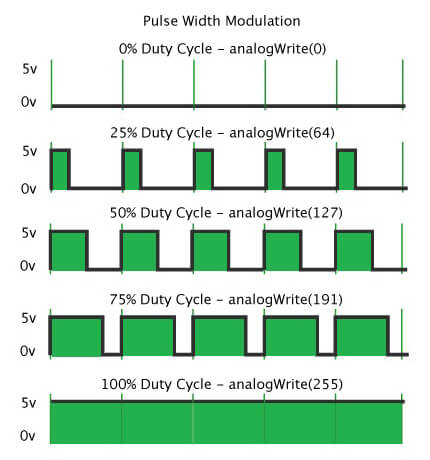

## What is PWM?

**PWM (Pulse Width Modulation)** is a technique used by microcontrollers to control the average power delivered to a device by rapidly switching a digital output **ON** and **OFF**.

PWM is commonly used for:
- Controlling LED brightness
- Controlling DC motor speed
- Controlling fans
- Servo motors
- Power electronics

## How PWM Works

A normal digital GPIO pin has two possible states:

```text
HIGH = ON
LOW  = OFF
```
PWM switches rapidly between these two states. Below are some of the basic duty cycles:

