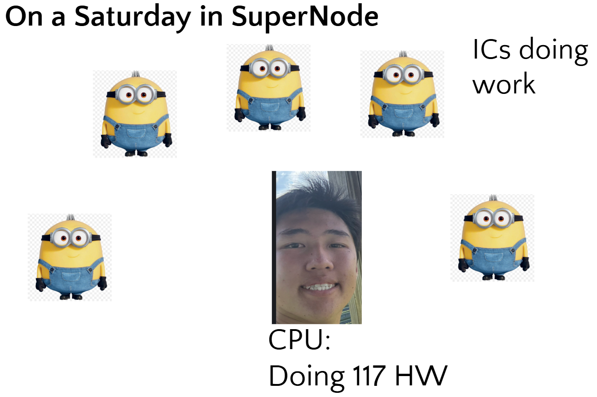
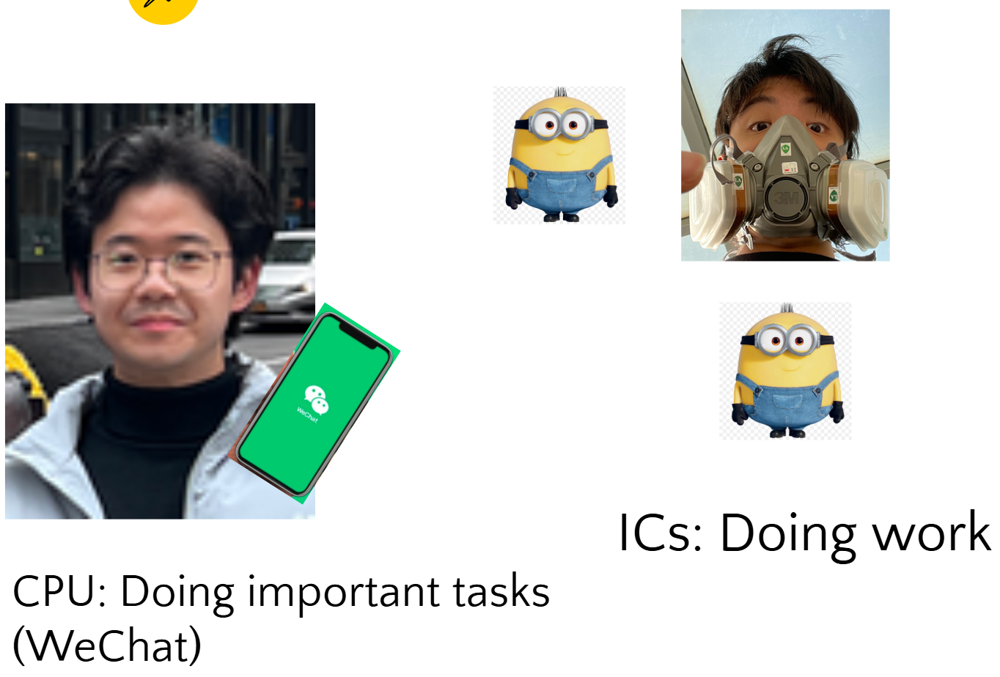

# Simplifying IO

IO stands for **input/output**. The input/output discussed in this reading will be the physical connection between hardware and firmware. Let's first explore how IO pins on the ESP32 work on an abstracted level, then learn smarter schemes of how to use them.

## Using IO in ESP-IDF
To use a standard IO pin in ESP-IDF (documentation [here](https://docs.espressif.com/projects/esp-idf/en/stable/esp32/api-reference/peripherals/gpio.html)), you first have to include the GPIO driver so that your system knows to import the relevant functionality:

```
#include "driver/gpio.h" // GPIO driver for ESP32 allows you to control the GPIO pins on the ESP32
```
For each GPIO pin, you then have to configure it for either input or output. Below is a sample implementation of how to configure for output:

```
// Configure GPIO pin for output
gpio_num_t peripheral_pin = (gpio_num_t)arg; // Cast the argument to gpio_num_t type
gpio_reset_pin(perhiperal_pin); // Reset the GPIO pin to its default state
gpio_set_direction(peripheral_pin, GPIO_MODE_OUTPUT); // Set the GPIO pin as an output pin
```

To set the output of a GPIO:

```
gpio_set_level(peripheral_pin, 1); // Set GPIO pin high (on)
gpio_set_level(peripheral_pin, 0); // Set GPIO pin low (off)
```

To read the input into a GPIO:

```
gpio_get_level(peripheral_pin);
```

_Note: for GPIO input, we typically use external pullup/pulldown resistors, so you can set the internal pullup/pulldown using `gpio_set_pull_mode(peripheral_pin, GPIO_FLOATING);`_

## So What?
Okay so it's pretty simple to implement IO, but what is really happening under the hood? To motivate the use of our following techniques, let me pose a few non-trivial questions:
- How is data actually read?
- How do bits actually get written and read as packets?
- If my ESP is busy with another slow task, how can I ensure my ESP will "hear" the input
- How do we precisely time reading and writing?

### IO pins
**IO. is. slow.** At their most basic level, IO pins are the physical metal legs (or pads) on the outside of the ESP32 chip. They bridge the microcontroller's digital brain to the physical world.

#### Voltage as Data
To understand IO, we must first understand the concept of digital vs analog.
- Digital: binary 1s and 0s, what most MCUs understand
- Analog: the physical world, (π, 5.5, 14)

The ESP32 only understands binary (1s and 0s), but the physical world speaks in analog. IO pins translate between the two using voltage. 

For the ESP32, its standard operating voltage is 3.3 Volts (V). Therefore, digital IO pins recognize exactly two distinct states:

- HIGH (1): voltage is at or near 3.3V
- LOW (0): Voltage is at or near 0V (GND)

Any time we called `gpio_set_level()` or `gpio_get_level()` earlier, we were directly manipulating or reading the electrical voltage on that specific metal pin.

#### Input vs Output
IO pins must have their direction configured. This is because in either the input/output state, it acts in different ways:
- When configured as output: the ESP32 acts like a switch connected to a power supply. If you tell it to output HIGH, internal transistors connect the pin to the 3.3V rail, pushing power out into your circuit (like turning on an LED). If you output LOW, it connects the pin to GND.
- When configured as input: the ESP32 acts like a tiny voltmeter. It passively listens to the wire connected to it, and if an external sensor applies 3.3V to the pin, the ESP32's internal circuitry detects it and registers a `1` in software.

If you think about it, the IO pin only will know what the voltage is at the exact fraction of a millisecond that you check it since it has no memory...so how can we solve this issue?

### Polling


Imagine I am sitting in Supernode doing my homework while an electrical meeting is happening. To gather input of what other people are working on, I can poll them! In other words, I can go up to each member and ask what they are doing every so often. This allows me to get input periodically! This is the concept of polling.

Because an IO pin has no memory, **polling** enables us to continuously monitor its state so we don't miss any signals.

Polling simply means writing software that repeatedly asks the IO pin, "Are you HIGH or LOW right now?" over and over again in a loop.

#### Common Implementation
From both a hardware and firmware perspective, polling means literally checking if the IO pin is seeing a HIGH (3.3V) or LOW (0V) at a set time interval.

A simple use case is reading a button press. If we want to check if a button is currently pressed, we can run a loop that polls the line at 100Hz (100 time per second). In ESP-IDF, this looks like a continuous `while` loop that reads the pin, does something else with the data, and then delays:

```c
while (1) {
  // Poll the current state of the button
  int button_state = gpio_get_level(button_pin);

  if (button_state == 1) {
    // Do something because the button is pressed
  }

  // Wait 10 milliseconds before asking again (100 Hz polling)
  vTaskDelay(pdMS_TO_TICKS(10));
}
```

#### Trade-Offs
The main benefit of polling is **simplicity**. It allows us to read data in a very straightforward way. However there are two main drawbacks:

1) Wasted CPU Resources (Inefficiency): You can imagine in our complex system, there are many things going on at once. If we are trying to get 10 inputs at once, polling each IO 100 times a second gets very CPU intensive.

2) Data Loss (Blind Spots): You can imagine if we have a higher speed signal that is only active for a millisecond, and we poll every 10 milliseconds, there is a high chance we can miss the input.

### Interrupts


Now let's say I am sitting in Supernode and I need to get input from people again. Instead of standing up and asking them myself, I could have each member tap me on the shoulder when they are about to ask a question. They are interrupting my current task to deliver me input. We call this an interrupt!


To solve our polling drawbacks (wasted CPU cycles and missed signals), we introduce this idea of an **interrupt**, which has the hardware interrupt the software to announce something has happened instead of the software constantly asking the hardware if something happened.

#### Common Implementations

We commonly see interrupts in ICs and communication protocols, but we can really use it for anything.

In a real-world scenario, your ESP32 can sit completely idle (or work on a heavy processing task) and ignore its primary data IO pins.

Instead, we configure a specific IO pin as an "interrupt pin" set to watch for sudden electrical change (e.g. voltage spike from LOW to HIGH). The moment the electrical change happens, the hardware forces the CPU to pause its current task, read the incoming data at the exact frequency expected, and then return to its primary task.

Typically you use an Interrupt Service Routine (ISR), which is a function you write in your C code that is automatically called the exact moment the interrupt pin is triggered. We will not be asking you to implement interrupts in this lab, so we will leave the exact implementation for you all to find out. The main idea is that when an interrupt is triggered, it queries that function!

#### Trade-Offs

We can see that we have just solved our two problems!

1) No Wasted CPU Resources: we are no longer wasting time on polling when no data is coming.

2) No Data Loss: we can't miss data if we are notified exactly when the data is coming. Another important fun hardware note is that we must make sure in layout the timing of our interrupts are precise, as otherwise we will poll at the wrong time.

However, there are some new drawbacks. The main one being complexity. For interrupts to work, we need a synchronized and dedicated interrupt IO pin. We also need to know how to time the polling.

In summary, we should use interrupts when the data we need is very precise and known, while polling deals with more general cases.

### Buffers


Now let's go back to Cory Hall. Imagine I am trying to remember all the inputs the members are giving me, but because of my other work I don't really have time to deal with them now. Instead, I can write down all of their questions on a piece of paper to buffer them. When I have the time I can then work my way through the questions and come up with answers. To save my own time, I can then write down the answers on a piece of paper and then answer all my members questions at once. What I've described are **input and output buffers**!

There is however one big lingering question. How do we go from bits to packets, and packets to a datastream!

#### As an API
In software and hardware, a buffer is simply a designated block of memory (like an array in RAM) used to temporarily store data while it is being moved from one place to another.

When you use a higher-level API in ESP-IDF (like reading from a UART serial port or an I2C sensor), you usually don't interact with the raw IO pins at all, and instead buffer abstracts it all away.
- Reading (Input Buffer): the ESP32's internal hardware (or a very low-level interrupt) watches the IO pin. As bits come in, the hardware automatically groups them into bytes and writes them sequentially into an array in memory (the input buffer). When your C code is finally ready to process the data, you just call a function like `read_data()`, which scoops a chunk of pre-collected data out of the memory array.
- Writing (Output Buffer): if you want to send a long text string to a display, toggling the IO pin HIGH and LOW manually for every single letter would be a nightmare. Instead, you drop the entire string into an output buffer, and let the hardware know that it's ready to send while your code immediately moves onto the next task. The hardware automatically drains that buffer, converting the bytes back into HIGH and LOW voltage pulses on the pin.

_Note: a very common implementation you will see in embedded systems is the **Ring Buffer** or **Circular Buffer**, which acts like an endless loop of memory where old data is overwritten by new data as it gets processed!_

### Conclusion
Here you have seen how to use polling, interrupts, and buffering to deal with IO pins in a smart way. To get practice, we recommend doing exercise 3v1 to practice implementing and using polling, buffers and interrupts
