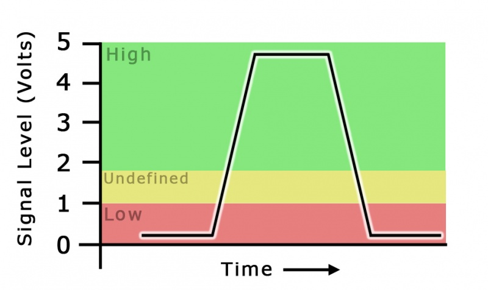

# Simplifying IO

IO stands for **input/output**. The input/output discussed in this reading will be the physical connection between hardware and firmware. Earlier in this section, you learned how IO pins on the ESP32 work on an abstracted level. Now, we will learn smarter schemes of how to use them.

To motivate the use of our following techniques, let me pose a few non-trivial questions:
- How is data actually read?
- How do bits actually get written and read as packets?
- If my ESP is busy with another slow task, how can I ensure my ESP will "hear" the input
- How do we precisely time reading and writing?

## Hardware

Without confusing you with all the gritty details I will briefly give a conceptual idea of how Hardware actually does digital input/output. Hopefully, this will motivate the techniques you will learn.

### Input

We will define in much greater detail of what a bit or byte is, how bits are communicated on a wire, and exact protocols in sections 4 and 5, but the gist of how IO pins work is that we have low and high thresholds.

What do I mean? A signal is considered a 0, if the voltage it sees on the line is low, and it is a 1 if it sees a high. Intuitively, a low would be just 0 voltage and a high voltage would just be the voltage rail (the supply used by the IC). However, what if we have noise? Imagine a noise comes through on my 5V rail IO pin that is supposed to be low, and it spikes the voltage to 0.2V. Obviously, this isn't high, but it's also not zero.

In digital, we define high and low based off of the thresholds of our IO standards. For simplicity, just know that we can find the exact Vthreshold Low and Vthreshold High on our datasheets, referring to the threshold to be a low or a high signal respectively. We can see this easier in our image below:

There is obviously a lot more nuance, but for now this should give a good intuition.

### Output

Our outputs are similar, but instead of reading a threshold, we are pushing or pulling our rail to either the high or low state. You can also find output ranges on datasheets.

### Re-motivating Pull-ups and Pull-downs

Hopefully this re-motivated the idea of pull-ups from the hardware lab. If we really need our digital signal to be high or low, why risk it? If we are not high or low, we are called floating, and this can cause problems. Instead, we can set a "nominal" state of that line as high with a pull-up or low with a pull-down! 

## Polling

A lot of the talk of hardware above, was to motivate this idea that for our IO pins bits are read serially (one at a time). Here we will discuss a naive way to read these bits.

### Analogy

TODO add picture

Imagine I am sitting in Supernode doing my homework while a meeting is happening. To gather input of what other people are working on, I can poll them! In other words, I can go up to them and ask what they are doing every so often. This allows me as lead to get input! This is polling.

### Common Implementation

An example implementation is a function that attempts to read from an IO every 10 millisecond (we will discuss how to implement this in a later section). We are polling the input at 100 Hz. 

From a hardware perspective, we are literally checking if the IO is seeing a high or low every 10 milliseconds. 

A simple use case is for a button. If we want to see if a button is pressed, we can poll and see if the voltage seen on the line is high or low from the button.

### Trade-Offs

The main benefit of polling is simplicity. It allows us to read data in a very straightforward way. However there are two main drawbacks:

1) Speed: You can imagine in our complex system, there are many things going on at once. If we are trying to get 10 inputs at once, polling each IO 100 times a second gets very CPU intensive.

2) Data Loss: You can imagine if we have a higher speed signal that is only active for a millisecond, and we poll every 10 milliseconds, there is a high chance we can miss the input.

## Interrupts

To solve our polling drawbacks, we introduce this idea of an interrupt!

### Analogy

TODO add picture

Now let's say I am sitting in Supernode and I need to get input from people again. Instead of standing up and asking them myself, I could have each member tap me on the shoulder when they are about to ask a question. They are interrupting my current task to deliver me input. We call this an interrupt!

### Common Implementations

We commonly see interrupts in ICs and communication protocols, but we can really use it for anything.

An example of how we would use an interrupt, is to sit idle and not poll on our "data IO pin" in our nominal state. However, when an interrupt is seen on our "interrupt IO pin" we now start reading data on the data IO pin at the exact frequency we expect to see!

### Trade-Offs

We can see that we have just solved our two problems!

1) Speed: we are no longer wasting time on polling when no data is coming. We are no longer wasting resources.

2) Data Loss: we can't miss data if we are notified exactly when the data is coming. Another important fun hardware note is that we must make sure in layout the timing of our interrupts are precise, as otherwise we will poll at the wrong time.

However, there are some new drawbacks. The main one being complexity. For interrupts to work, we need a synchronized and dedicated interrupt IO pin. We also need to know how to time the polling.

In summary, we should use interrupts when the data we need is very precise and known, while polling deals with more general cases.

### More details

TODO maybe write something about ISRs

Interrupt exact implementation we will leave to you guys to find out, but the main idea is that when an interrupt is triggered, it actually queries a function! Exact implementation we will let you discover in the exercise!

## Buffers

There is however one big lingering question. How do we go from bits to packets, and packets to a datastream!

### Analogy

TODO Image

Imagine I am trying to remember all the inputs the members are giving me, but because of my other work I don't really have time to deal with them now. Instead, I can write down all of their questions on a piece of paper to buffer them. When I have the time I can then work my way through the questions and come up with answers. To save my own time, I can then write down the answers on a piece of paper and then answer all my members questions at once. What I've described are input and output buffers!

### Firmware Buffers

Some buffers you will deal with are on the firmware side. Let's say we receive a bunch of packets, but like me in Supernode, the CPU doesn't have enough compute power to handle the input.

I can create a buffer as some data structure that can hold packets. **Writing** to the buffer is taking polled data and adding it to the data structure. **Reading** from a buffer is taking polled data and using it.

### Ring Buffers

TODO image

A common implementation of a firmware buffer is a ring buffer!

Going back to my example, you can imagine I try to write everything down on a piece of paper, but eventually after enough questions I will run out of paper!

A solution is to use a whiteboard! Imagine I write everything on the whiteboard in Supernode. Now when I run out of whiteboard space at the bottom, I can erase the top question of the board and use that space.

As you can imagine we get the positive of effectively infinite space, but with the possibility we might **overwrite** our data. In C we generally implement a ring buffer as an array where we wrap the index to the front when we get to the end of the array. 

To get a little more detailed on implementation, you would probably also need to store where you are in the buffer at any given moment, but this can easily be done by storing the index of the last read and last write.

### Common Schemes (Hardware)

We just saw dealing with multiple packets, but what about multiple bits. Luckily, the hardware does this for you! Each bit is put into a buffer the size of a packet or two, such that we can buffer a whole packet before we read it in!

Due to the complexity of the subject and the fact you won't be implementing these, I will leave this to you to learn more specifically how these are implemented. For those interested in working with FPGAs, this is pretty important.

## Conclusion

Here you have seen how to use polling, interrupts, and buffering to deal with IO pins in a smart way. To get practice, we recommend doing exercise 3v1 to practice implementing and using polling, buffers and interrupts
