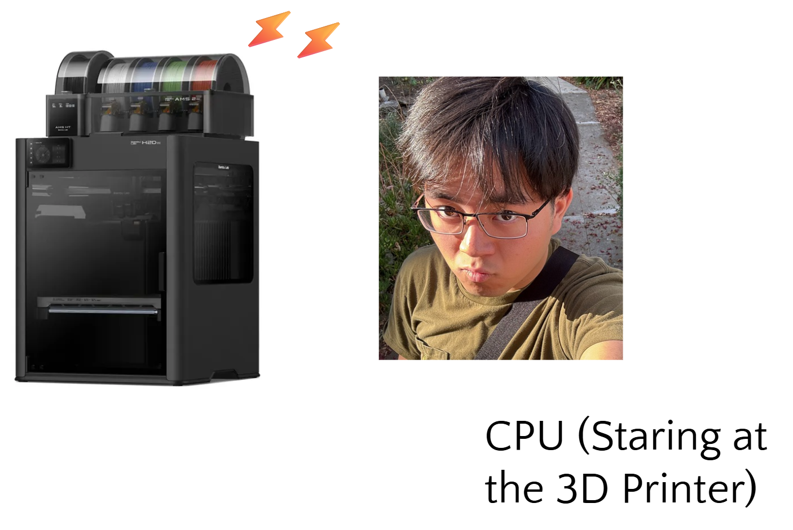
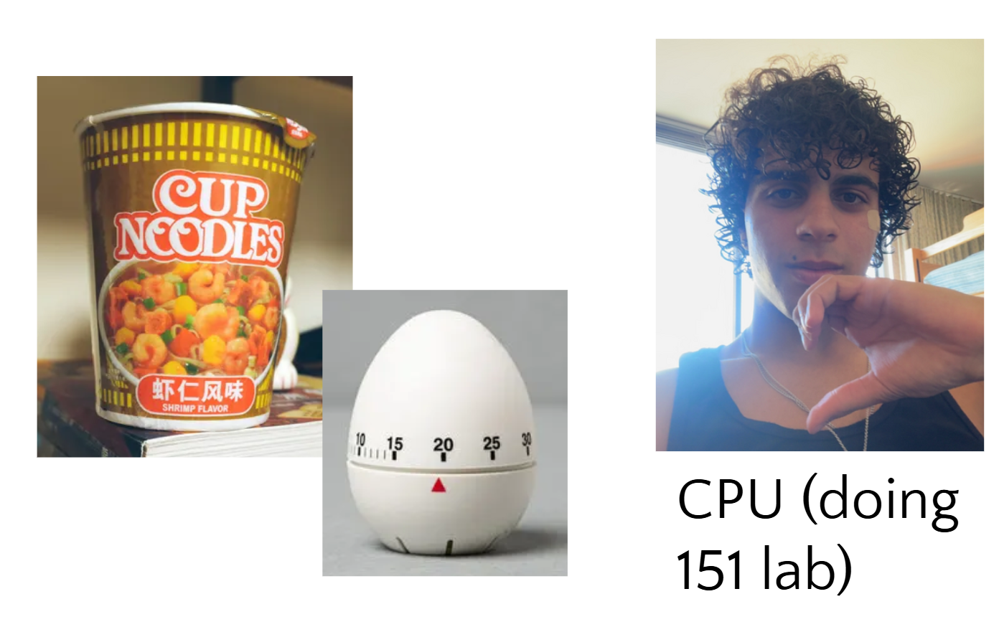

# Timing and Synchronization

## Motivation

Up until now, we've talked about how to read and write data, but we haven't talked about how we determine _when_.

The ESP32's processor executes millions of instructions per second. If you write a line of code to turn an LED on, and the very next line it turns off, the LED will blink so fast that your eyes won't even register that it turned on. If you need a sensor to read data at exactly 100 Hz (100 times per second), you need a way to ensure your code waits that exact amount without locking up the entire system.

## Naive (Busy Waiting)


Imagine you are in Supernode waiting for a 3D print to finish, and you know it takes exactly 10 minutes. A "busy waiting" approach means you stand directly in front of the printer, staring intensely at the nozzle, doing absolutely nothing else for 10 straight minutes until it finishes.

The most intuitive way to delay an action is to just make the processor count to a really high number before moving on. We call this **busy waiting** or blocking.

### Common Implementation
In code, this usually looks like an empty `for` loop (also called spin waiting as we are spinning around an empty loop) or a blocking delay function that hogs the CPU:

```c
// Busy waiting: the CPU is trapped in this loop doing nothing
for (int i = 0; i < 100000; i++) {
    // Just count up and waste time
}
```
_Note: while `vTaskDelay()` in ESP-iDF looks like a delay, it actually yields the processor to the OS, which is much smarter. But truly busy waiting is literally just stalling the CPU!_

### Trade-Offs
The only benefit to busy waiting is that it is trivially easy to write. However, it has huge drawbacks:
1. Total inefficiency: you are freezing the entire processor. It cannot read sensors, update displays, or communicate over Wi-Fi while it is busy staring at the clock.
2. Inaccuracy: if an interrupt fires while you are busy waiting, it throws off your timing, and now you can't guarantee exactly how the wait actually took.

## Timers and Tickers


Okay now let's say I'm making cup noodles (for a long night in Cory Hall). Instead of staring at the noodles cooking, I set a 10-minute alarm on my phone and do my homework while I wait. I am completely productive until the exact moment my phone alarms (ticks), at which point I pause my homework, eat my noodles, and go back to work.

To fix the busy waiting problem, we use **Timers and Tickers**! A timer is essentially a dedicated hardware/software alarm clock. Instead of the CPU wasting time counting, a separate clock circuit handles the counting in the background and triggers an interrupt (or callback function) when the time is up!

_Note: Timers are the actual physical silicon peripheral (clock circuit) built into the chip and is completely independent of the main processor. Tickers are the software abstraction built on top of a hardware timer. For our purposes, they are functionally the same thing and we will call this concept timers in general._

### Timer Setup
In ESP-IDF, we can use the High-Resolution Timer (`esp_timer`) API (documentation [here](https://docs.espressif.com/projects/esp-idf/en/stable/esp32s3/api-reference/system/esp_timer.html)) to set up recurring "ticks." To use a timer, you need three things:
1. Callback Function: the code that runs when the timer goes off
2. Timer Configuration: telling the timer which callback to use
3. Start Command: telling the timer how often to tick (in microseconds)

### Exercise 🎯: Timer Example
To see a complete, working example of a timer running in the background, please check out the code provided in your **example folder**!

For example, on my file system the example is found here: `C:\esp\v6.1-beta1\esp-idf\examples\system\esp_timer\main`

Here is a cheat sheet of how they work:
<details>
<summary>Data Types and Configurations</summary>
    
- `esp_timer_handle_t`: the data type used to store the reference to your specific timer
- `esp_timer_create_args_t`: a configuration struct used to set up the rules for your timer before it get built. The two most common fields are:
    - `.callback`: a pointer to the function you want the timer to run when it ticks (e.g. `&my_timer_callback`)
    - `.name`: a text string used to name your timer, which helps with debugging
</details>

<details>
<summary>Core Functions</summary>

- `esp_timer_create(const esp_timer_create_args_t* args, esp_timer_handle_t* out_handle)` takes the config struct (`args`) and links it to an uninitialized timer handle (`out_handle`). This builds the timer in memory and allocates resources, but **does not start** the block.
- `esp_timer_start_periodic(esp_timer_handle_t timer, uint64_t timeout_us)` starts the timer and tells it to trigger its callback repeatedly on a set interval. The `timeout_use` argument dictate the length of the interval in microseconds.
- `esp_timer_start_once(esp_timer_handle_t timer, uint64_t timeout_us)` starts the timer, but it will only trigger the callback a single time before automatically stopping. This is ideal for creating a one-off background delay without using busy-waiting.
- `esp_timer_delete(esp_timer_handle_t timer)` immediately pauses an active timer so it stop triggering callbacks.
- `esp_timer_delete(esp_timer_handle_t timer)` completely destroys the timer and frees up the memory it was using. You must call `esp_timer_stop()` before you can safely delete a timer.
    
</details>

## Scheduling
Timers and interrupts are SO useful in keeping track of things. But let me pose a few questions:
- What happens when you have fifty different things that need to run at different times?
- What if a timer ticks while you are right in the middle of processing important Wi-Fi data?
- Who gets to use the CPU first?

We can manage all of these overlapping tasks, timers, and interrupts automatically using Real-Time Operating Systems (FreeRTOS), which decide which tasks run, when they run, and who gets priority! You'll find out more in the next section!
