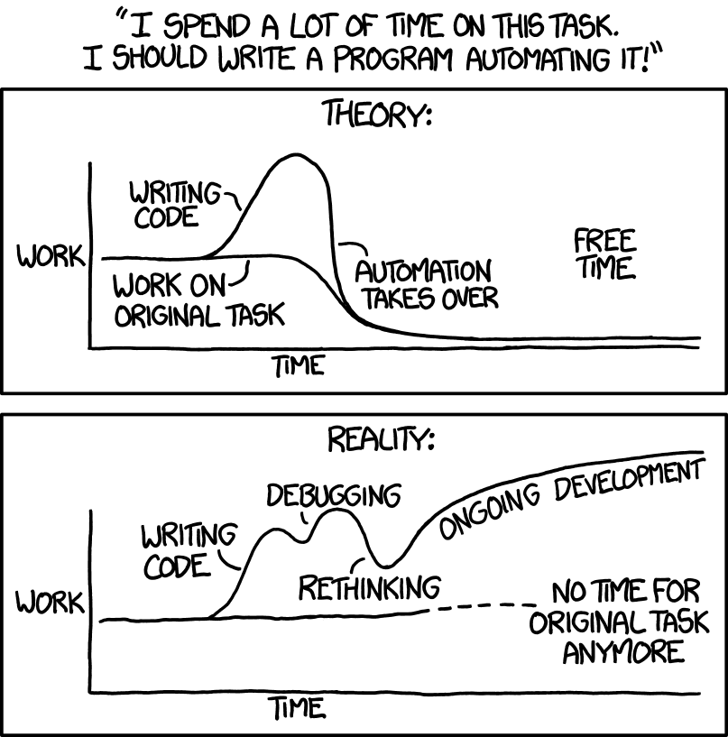
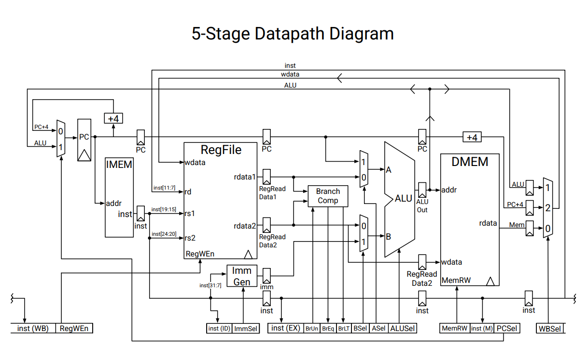
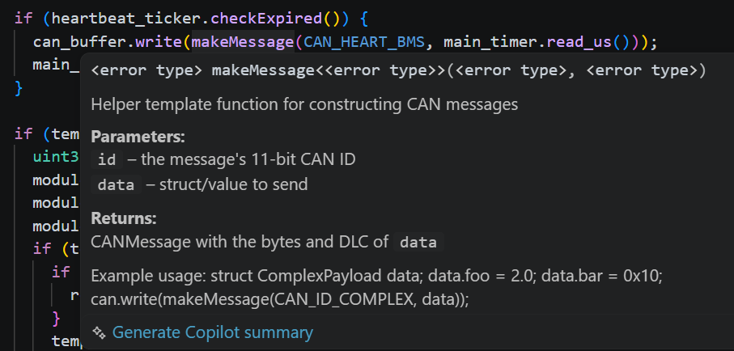

# Introduction to Complexity

Firmware and code in general will seem complicated at first. However, with some techniques and tool, we can tackle firmware together! 

*Taken from XKCD*

## Dependencies and Information Overload

Let's say I'm trying to create code that turns on the physical brake lights when the brake pedal is pressed.
This begs a few questions. 
- How does the car know the brake pedal is being pressed?
- How does the car know how to time keeping the lights on?
- How does it keep time?
- How do the pedals on the bottom shell talk to the brake lights on the top shell?
- How do the brake lights vary in intensity?

There are a lot of questions that need to be answered and to be honest, it seems intimidating. To even understand one simple part of the car, it seems as if you would need to understand a bunch of other things.

Another example (which some of you may recognize and others will see in the future) is the RISC-V CPU. For anyone seeing this for the first time, this is an incredibly daunting piece of computing. However, those who have taken it will know that we can handle the complexity of this in a very simple way.

*Taken from CS61C Reference Card*

### Abstraction

Our solution (and one you will see EVERYWHERE in EE and CS) is Abstraction!!!

Abstraction is simplifying a system through omitting unimportant details. For example, to understand how to drive a car, you don't need to know exactly how the hardware of the car actually drives the motor. Instead, all you need to know is that when you press the pedal, the car accelerates, which is much more useful than how the whole cars system works. As you can see, we can convert complex systems into simple abstractions that are more useful for us to use.

### Modularity

Abstraction is often implemented with modularity. A module in code can be a function where we abstract away the exact details of how it works, and instead just focus on how the function can be used. Throughout this lab we will go through a lot of important abstractions, but here I will give a general overview of how to read libraries and common firmware abstractions.

Take here, me hovering over the makeMessage function.

We will talk more in detail of what this function actually does, but the point I'm making is that instead of understanding the details of the function, we just need to know that it makes a message with parameters, being a specific ID and specific data. It becomes a lot simpler to have complicated functions be implemented modularly, so we don't need to deal with the details as much as the system.

Modularity also matters in how YOU program! Later, we will discuss ways to make the whole code for a system modular, but for now we will discuss on a more micro level. Here are a few rules for this:
- If you are doing something multiple times, create a function for it! This will make code shorter and more readable. It will also save a lot of time
- If you are directly interfacing with hardware (you will see a lot more about what this means later), make a function to do so. This will keep the firmware code a lot more focused on the logic and less on the specifics of how we deal with firmware.
- Make modules work in isolation from the rest of the code and be robust to be used in many situations. If a module is supposed to handle inputted data, make sure it can handle all types of data and returns the data in a way that is easily usable by any other program.

## Obscurities and Overengineering

The worst part of code is being lost and not understanding how the code works. At worst, we can see complexity with obscure and hard to understand code. This can prop up in so many ways:
- Functions are badly named and explained. You have no idea what calling that function would do, so you go on a wild goose chase to understand it
- What is a variables purpose? Sometimes it is unclear what you are even doing to a variable
- And so much more confusing code

### Documented Code

The easiest way to make code less obscure is to literally explain it. Code comments are an amazing way to explain what you are doing. This is important for helping everyone who will ever read this code (and yes this includes you 2 weeks are you wrote it).

Here are some other good habits you should have:
- Good code names. If a variable name is self explanatory, it becomes much simpler to reason how the logic of the code works
- Be consistent. If every integer has the same format, it makes it a lot easier to recognize what are integers
- Explain what a block of code does above the code. Priming what the codes purpose is before the reader attempts to understand it, makes life a lot easier.
We won't go over exact commenting convention, but just use common sense and make sure code is OBVIOUS!

*Taken from XKCD*

### Planning

The other main obscurity shows up in the pile up of technical debt. Imagine we are trying to write a program that turns on the brake lights. If you were to naively start programming, you might just take the brake pedal value from 0-100 (for simplicity it is more like 0-255) and correlate that to 0-100% on the brake lights. Assume for simplicity as well, it is abstracted out exactly how we do all of this. 

Wow, with a little abstraction, we have fixed our brake lights problem!!! Not so fast... We have forgotten to account for regen braking. Now, we must on top of our existing code add extra if statements and logic to deal with both forms of braking data (pedal and regen), including which one has priority and when. Okay, now we are done right? Not exactly, now let us take the case where the car is on a bumpy road and the lights start to flicker due to mechanical fluctuations. We now need to integrate into our already written code some way to filter data from mechanical pedal and regen. However, this will cause the problem that a filter might filter out a slamming of the brakes. This would need to be solved with potentially another case check. 

As you can see, there are a lot of unseen problems that will come up. The complexity from this comes with needing to integrate all of these cases sequentially after writing each one. You will learn that the secret to simple code is planning out these cases ahead of time. If you don't, you will make code more complicated. We call this technical debt, because you will need to pay off the time of lack of planning in debugging later down the line.

To cope with this, there is no shortcut. We will need to plan things out. Later on, we will discuss in detail smarter ways to do this.

## What Tools Will We Use?

Throughout this section, you will see a lot of techniques that programmers everywhere use to write non-complex code. You will soon learn, that all of the seemingly difficult techniques you will see are actually clever ways to manage complexity and make code easier to read and write. This lab is only the tip of the iceberg (and you learn much more in EVERY hardware and software class at Berkeley about this), but we hope this is a good start.
