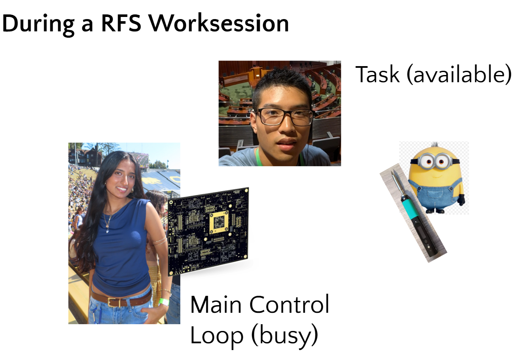

# Real Time Operating Systems / Tasks

An RTOS is a Real Time Operating System. We use an RTOS to allow for parallel and concurrent programming, but in this section we will mainly discuss it's ability to let us call tasks from our main control loop. This allows for us to write considerably more powerful programs. In this section, we will show you how an RTOS works, and how it should be leveraged to do tasks. 

## Tasks

Imagine that I am at Richmond Field Station (RFS) debugging an important board in the car. Then, someone is asks me for help soldering wires to a connector. If I handle this naively, I have to stop my important debugging, walk over to the soldering station, and watch the person solder for 30 minutes until it finishes. Nothing is happening.

However, what if I ask a different electrical member to help watch the person solder? I can continue debugging my important board while the electrical member watches the other person. Both are getting jobs done at the exact same time. In firmware, asking an electrical member to handle a job is exactly what calling a **Task** does!

If our Main Control Loop is acting as an FSM (Finite State Machine) making logical decisions, it needs to run as fast as possible. If we need to wait for slow hardware sensors to read data, we instead spin up a FreeRTOS Task to handle the sensor in the background.

### When do we use what?

Functions

  
Use these for quick logic calculations (like finding an average). They pause the loop/task, compute, and return instantly

Timers

  
Use these for precise, fast background ticks (like toggling an LED every 10 ms)

Tasks

  
Use these for heavy, infinite loops that deal with hardware (IO actions). If a process requires waiting, reading a stream of data, or managing, it belong in a Task

To actually create a task in FreeRTOS a command called `xTaskCreate()`. This tells the OS to take a specific function you wrote and started running in it own parallel infinite loop. For exact syntax and implementation details, check out the provied example foldr!

## Task Queues

If the Main Control Loop and Task are running at the same time in parallel, how do they talk to each other? We do this using **task queues** like a secure mailbox sitting between my main loop and task.

Instead of the Task constantly asking the Main Control Loop, the Task simply goes to sleep. When the main control loop, decides it is time to do something, it drops a message into the Queue. RTOS automatically walks up to the Task. the Task reads the message, executes the hardware action, then goes back to help

## Under the Hood

How is the system actually doing two things at once?

First, the ESP32 chip has two physical cores (Core 0 and Core). This means it physically has two separate brains that can execute two different lines of code at the exact same microsecond.

But what happens if we create 10 tasks? We can't run 10 things on 2 cores simultaneously. This is where the FreeRTOS Scheduler steps in, which rapidly switches the cores between your divider tasks. It happens so fast that it creates the illusion that all 10 tasks are running at once.

There is a problem: if two separate tasks try to read and write to the same global variable at the same exact microsecond, the data can be corrupted and crash the system. Dealing with this danger requires Synchronization, which we will not delve into in this lab.

## Summary
- RTOS Tasks allow us to run code concurrently
- We reserve the Main Loop Control Loop for fast FSM logic, and we offer slow hardware interactions to **Tasks.**
- Task Queues act as the communication bridge, allowing tasks to sleep efficiently until the main loop sends them data.
- Under the hood, the ESP32 uses its dual cores and the FreeRTOS Scehduler to rapidly judggle targets
