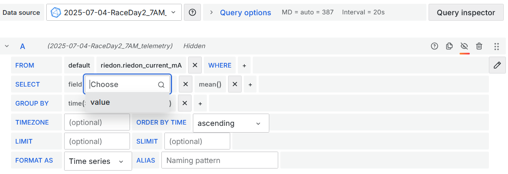

# Telemetry Architecture 

The basic idea behind the telemetry board on the car is that it broadcasts all the CAN messages from the car on a 900MHz frequency band. Then, that is picked up by our antenna, which is translated with our code. 

Strategy is responsible for everything that happens once the message leaves the car, which includes: 
* Antennas 
     * 2 Yagi (directional) antennas, one 13dbi and 3 dbi
     * 1 Omnidirection antenna, 5dB
* XBees 
    * How we communicate with the car. Current Xbees are set to a baud rate of 230400
    * Use the XCTU software to configure these XBees
    * There is also multiple confluence pages, if you would like to read more
    * Note: to run custom program on the xbee, we need to put them into bypass mode. 
* Software
    * Current version of telemtry is in the repo named 'new-telemetry' aka SLIVER Telemetry
        * This parses the raw messages from the car
    * Database management with InfluxDB 
    * Visualization with Grafana
  


Once the messages are parsed with our code, they are logged into an **InfluxDB *bucket***. You can think of this bucket like a collection of measurements for one specific day. 


<details>
  <summary>Other InfluxDB Terms</summary>
  
- An InfluxDB Bucket is a collection of measurements. We have one bucket per logging session. All data in a bucket is logically separate from every other bucket, and when we export data from influxdb, we export and import entire buckets.
- An InfluxDB Measurement is basically like a 2D spreadsheet.
- An InfluxDB Field is like a single column in a spreadsheet.

</details>

Finally, the InfluxDB bucket is connected as a Grafana Datasource, where data can be queried via *InfluxQL* or *Flux*. Its currently only set to accept *InfluxQL*. 


# Telemetry Code Stack

## Telemetry Messages 
Each message is [COBS Encoded](https://en.wikipedia.org/wiki/Consistent_Overhead_Byte_Stuffing), using the null byte as a separator. The main code the encodes the messages on the car is [here](https://github.com/CalSol/Tachyon-FW/blob/master/Telemetry/encoding.cpp). 

COBS Encoding basically allows us to have differing length messages by knowing how long each "message" is and where each delimiter is. 

We know we have recieved 2 messages: `AA BB C5 D7 34` and `22 12 32 AB EF`. If we didn't use COBS encoding, we could have been in a situation where a message contained a null byte, and when we read it we would think it was two bytes.


Thus, each message is structured by the following: 
* CAN ID (1.5 bytes) 
* Length of message (0.5 bytes)
* Payload variable
* Checksum (1 byte)

<sub><sup>Note: The XBees also have a 16 bit redunancy check sum. </sup></sub>

For example, if we have the message 

```
AA BB C5 D7 34 00 22 12 32 AB EF 00
```


Most messages tell us exactly one value, but a few contain multiple values per message. 

For example: 

Rideon current only has 1 value per message. 


Every bank of the BMS has 4 values per messge. 


## Configuration Files
Most of our configuration files are in `.json5` file formats. Its basically the same as `.json`, except that it allows for comments.

Additionally, it also allows imports. If you are familiar with $\LaTeX$, it is similar to `\input`, where it basically just pastes a file into another. This is denoted by using the `$` operator. 

For example, this is an excerpt of one our `can_def.json5` file. 

```json5
{
    "rear_lights" : "$boards/rear_lights.json5",
    "steering" : "$boards/steering.json5",
    "petals" : "$boards/petals.json5",
    "riedon" : "$boards/riedon.json5"
}
```

This means that when the code processes the file, it would look something like this. 

```json
{
	"rideon": {
	    "messages" : {
	        "0x3F1"  : { "name" : "riedon_current",       "type": "s32",        "unit" : "mA" },
	        "0x3F4" : { "name" : "riedon_couloumb_count",       "type" : "s64",        "unit" : "" },
	        "0x3FB" : { "name" : "riedon_can_read",       "type" : "u8",        "unit" : "" }
	    }
	}
}
```

Thus, the CAN_DEF configuration is very important to set to determine what type the message is, and whether or not its a single valued or multi valued message. 

For example, if the code recieves a message with `can_id: 0x3F1`, it will know it is the `riedon_current`, as a `s32` (signed 32 bit integer), with units in `mA` (miliAmps). 

We can also define custom types in `can_struct.json5`, such as our `u16_arr` or `bms_error`. 

<details>
  <summary>Click to see file excerpt</summary>
  
```json
"bms_error" : [
        // This is a bit field... gonna be so messy
        // Going to set a convention of bitfields being specified in order of most significant bit to least.
        { "name" : "errorOverTempDischarge",    "type" : "b1" },
        { "name" : "errorOverTempCharge",       "type" : "b1" },
        { "name" : "errorOverVoltage",          "type" : "b1" },
        { "name" : "errorUnderVoltage",         "type" : "b1" },
        { "name" : "errorOverCurrent",          "type" : "b1" },
        { "name" : "errorOverCharge",           "type" : "b1" },
        { "name" : "errorMissingMeasurement",   "type" : "b1" },
        { "name" : "errorOnAux",                "type" : "b1" }, // So this is the least significant bit 
        { "type" : "p6" }, // Padding signified by no name
        { "name" : "errorUnderTempDischarge",   "type" : "b1" },
        { "name" : "errorUnderTempCharge",      "type" : "b1" },
          { "type" : "p16" },
    ],
    "u16_4arr" : [
        { "name" : "val_1", "type" : "u16" },
        { "name" : "val_2", "type" : "u16" },
        { "name" : "val_3", "type" : "u16" },
        { "name" : "val_4", "type" : "u16" },
    ],
```
</details>

## Telemetry Code 

We have 3 main implementable classes in the Telemetry code. These are *Ingestors*, *Processors*, and *Loggers*. 

The idea is that the code should behave the same way regardless of whether we get our data from the XBee radio, or through a direct USB connection. So the main program control flow is very general, and it is handled with polymorphism (Ingestor, Logger, Simulator, and Processor are classes and things like XBeeIngestor are subclasses).

We have ideas to implement more robust simulators for testing purposes. 
### Ingestors


Ingestors take in a source of data, which we will denote as a **Raw Message**

Our current ingestors are 
* XBee Ingestor: primary data source, reads in messages from an XBee modules connected via a USB
* Keyboard Ingestor: To log laps, or other inputs into the database. Not sure how much this is used. 
* Simulator Ingestor: To play back messages from a file with bytecode

We want to expand on the functionality simulator ingestor.

Possible Ingestor expansions:
* USBtin ingestor: get data if directly plugged into the car via USB. 


### Loggers 
A logger is a data output. Examples include:

- InfluxLogger: Store data in InfluxDB. This is the primary logger we use.
- CSVLogger: Store data in csv files
- The default Logger: Just prints the data out to the terminal

### Procesors 
Processors, runs between ingestors and loggers to look at the data and possibly modify it.


Examples and possible future processors include:

- A processor that when it sees RPM data, it calculates a speed in miles per hour, based on the tire radius, and adds that as a data.
- A processor that integrates an SOC estimator.
- A processor that converts GPS data into the correct units.  
- A possible future processor that monitors GPS data and notes when we get near checkpoints


## Grafana

Grafana visualization are the main strategical and safety outputs of the telemetry stack during race. Our main dashboard as of 27 September 2026 is [here](https://grafana.calsol.dev/goto/cfzkhfuyrgef4b?orgId=default). 

The *Data Source* variable at the top the screen allows us to see what bucket / session we logged our data in. 

Below is a sample query. **The data source has to be changed to ${data source} in order for the variable mentioned above to work** . We also have the SQL-like query format of 

```SQL
SELECT AGG_FUNC(message_value)
FROM message_name
WHERE conditions
GROUP BY timeInterval
```


As always, GROUP BY and AGG_FUNC are optional. The default value of `GROUP BY time($__interval)` actually calculates a dynamic interval based on the timeframe selection and the max data points per series. Sometimes, we might actually want to group by a defined interval like `1s` instead.  