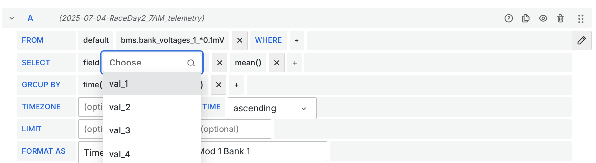
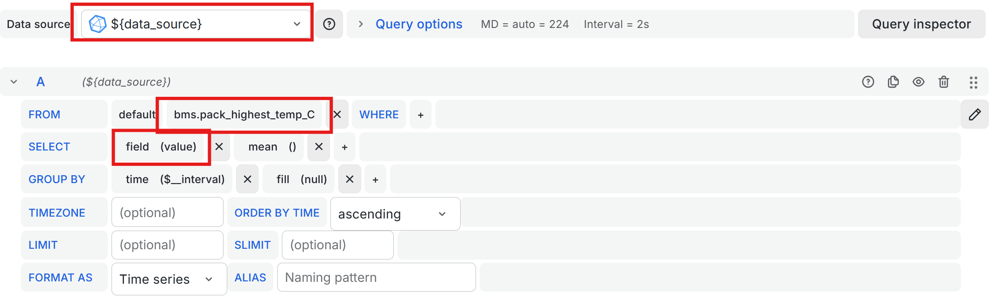

# Table of Contents
<details>
<summary><b>Click to expand</b></summary>

- [Table of Contents](#table-of-contents)
- [Telemetry Architecture](#telemetry-architecture)
- [Telemetry Software Stack](#telemetry-software-stack)
  - [Telemetry Messages](#telemetry-messages)
  - [Configuration Files](#configuration-files)
  - [Telemetry Code](#telemetry-code)
    - [Ingestors](#ingestors)
    - [Loggers](#loggers)
    - [Procesors](#procesors)
  - [Grafana](#grafana)
- [A Note on Coding Standards](#a-note-on-coding-standards)
  - [Hard Conventions](#hard-conventions)
    - [Use type hints everywhere](#use-type-hints-everywhere)
    - [Private fields](#private-fields)
    - [Use pull requests](#use-pull-requests)
    - [Use uv for package management](#use-uv-for-package-management)
    - [No platform specific code](#no-platform-specific-code)
      - [Some specific things worth mentioning:](#some-specific-things-worth-mentioning)
    - [Secret keys, sensitive data, and names](#secret-keys-sensitive-data-and-names)
    - [Follow PEP 8 + Some of our own coding conventions](#follow-pep-8--some-of-our-own-coding-conventions)
  - [Soft Conventions](#soft-conventions)
      - [Commit early, commit often](#commit-early-commit-often)
      - [Avoid global mutable variables](#avoid-global-mutable-variables)
      - [Dead files](#dead-files)
      - [Error handling for internal and external input](#error-handling-for-internal-and-external-input)
</details>


# Telemetry Architecture 

The basic idea behind the telemetry board on the car is that it broadcasts all the CAN messages from the car on a 900MHz frequency band. Then, that is picked up by our antenna, which is translated with our code. 

Strategy is responsible for everything that happens once the message leaves the car, which includes: 
* Antennas 
     * 2 Yagi (directional) antennas, one 13dbi and 3 dbi
     * 1 Omnidirection antenna, 5dB
* XBees 
    * How we communicate with the car. Current Xbees are set to a baud rate of 230400
    * Use the XCTU software to configure these XBees
    * There is also multiple confluence pages, if you would like to read more
    * Note: to run custom program on the xbee, we need to put them into bypass mode. 
* Software
    * Current version of telemtry is in the repo named 'new-telemetry' aka SLIVER Telemetry
        * This parses the raw messages from the car
    * Database management with InfluxDB 
    * Visualization with Grafana
  


Once the messages are parsed with our code, they are logged into an **InfluxDB *bucket***. You can think of this bucket like a collection of measurements for one specific day. 


<details>
  <summary>Other InfluxDB Terms</summary>
  
- An InfluxDB Bucket is a collection of measurements. We have one bucket per logging session. All data in a bucket is logically separate from every other bucket, and when we export data from influxdb, we export and import entire buckets.
- An InfluxDB Measurement is basically like a 2D spreadsheet.
- An InfluxDB Field is like a single column in a spreadsheet.

</details>

Finally, the InfluxDB bucket is connected as a Grafana Datasource, where data can be queried via *InfluxQL* or *Flux*. Its currently only set to accept *InfluxQL*. 


# Telemetry Software Stack
Unlike all of this lab, Telemetry Software is written in **Python**. However, we (Strategy) still emphasize the need for all the lessons learned in Section 3 of this guide. This section will give you a short overview of how the lessons you learned before connect!


## Telemetry Messages 
Each message is [COBS Encoded](https://en.wikipedia.org/wiki/Consistent_Overhead_Byte_Stuffing), using the null byte as a separator. The main code the encodes the messages on the car is [here](https://github.com/CalSol/Tachyon-FW/blob/master/Telemetry/encoding.cpp). 

COBS Encoding basically allows us to have differing length messages by knowing how long each "message" is and where each delimiter is. 

We know we have recieved 2 messages: `AA BB C5 D7 34` and `22 12 32 AB EF`. If we didn't use COBS encoding, we could have been in a situation where a message contained a null byte, and when we read it we would think it was two bytes.


Thus, each message is structured by the following: 
* CAN ID (1.5 bytes) 
* Length of message (0.5 bytes)
* Payload variable
* Checksum (1 byte)

<sub><sup>Note: The XBees also have a 16 bit redunancy check sum. </sup></sub>

For example, if we have the message 

```
AA BB C5 D7 34 00 22 12 32 AB EF 00
```


Most messages tell us exactly one value, but a few contain multiple values per message. 

For example: 

Rideon current only has 1 value per message. 


Every bank of the BMS has 4 values per messge. 



## Configuration Files
Most of our configuration files are in `.json5` file formats. Its basically the same as `.json`, except that it allows for comments.

Additionally, it also allows imports. If you are familiar with $\LaTeX$, it is similar to `\input`, where it basically just pastes a file into another. This is denoted by using the `$` operator. 

For example, this is an excerpt of one our `can_def.json5` file. 

```json5
{
    "rear_lights" : "$boards/rear_lights.json5",
    "steering" : "$boards/steering.json5",
    "petals" : "$boards/petals.json5",
    "riedon" : "$boards/riedon.json5"
}
```

This means that when the code processes the file, it would look something like this. 

```json
{
	"rideon": {
	    "messages" : {
	        "0x3F1"  : { "name" : "riedon_current",       "type": "s32",        "unit" : "mA" },
	        "0x3F4" : { "name" : "riedon_couloumb_count",       "type" : "s64",        "unit" : "" },
	        "0x3FB" : { "name" : "riedon_can_read",       "type" : "u8",        "unit" : "" }
	    }
	}
}
```

Thus, the CAN_DEF configuration is very important to set to determine what type the message is, and whether or not its a single valued or multi valued message. 

For example, if the code recieves a message with `can_id: 0x3F1`, it will know it is the `riedon_current`, as a `s32` (signed 32 bit integer), with units in `mA` (miliAmps). 

We can also define custom types in `can_struct.json5`, such as our `u16_arr` or `bms_error`. 

<details>
  <summary>Click to see file excerpt</summary>
  
```json
"bms_error" : [
        // This is a bit field... gonna be so messy
        // Going to set a convention of bitfields being specified in order of most significant bit to least.
        { "name" : "errorOverTempDischarge",    "type" : "b1" },
        { "name" : "errorOverTempCharge",       "type" : "b1" },
        { "name" : "errorOverVoltage",          "type" : "b1" },
        { "name" : "errorUnderVoltage",         "type" : "b1" },
        { "name" : "errorOverCurrent",          "type" : "b1" },
        { "name" : "errorOverCharge",           "type" : "b1" },
        { "name" : "errorMissingMeasurement",   "type" : "b1" },
        { "name" : "errorOnAux",                "type" : "b1" }, // So this is the least significant bit 
        { "type" : "p6" }, // Padding signified by no name
        { "name" : "errorUnderTempDischarge",   "type" : "b1" },
        { "name" : "errorUnderTempCharge",      "type" : "b1" },
          { "type" : "p16" },
    ],
    "u16_4arr" : [
        { "name" : "val_1", "type" : "u16" },
        { "name" : "val_2", "type" : "u16" },
        { "name" : "val_3", "type" : "u16" },
        { "name" : "val_4", "type" : "u16" },
    ],
```
</details>

## Telemetry Code 

We have 3 main implementable classes in the Telemetry code. These are *Ingestors*, *Processors*, and *Loggers*. 

The idea is that the code should behave the same way regardless of whether we get our data from the XBee radio, or through a direct USB connection. So the main program control flow is very general, and it is handled with polymorphism (Ingestor, Logger, Simulator, and Processor are classes and things like XBeeIngestor are subclasses).

We have ideas to implement more robust simulators for testing purposes. 
### Ingestors


Ingestors take in a source of data, which we will denote as a **Raw Message**

Our current ingestors are 
* XBee Ingestor: primary data source, reads in messages from an XBee modules connected via a USB
* Keyboard Ingestor: To log laps, or other inputs into the database. Not sure how much this is used. 
* Simulator Ingestor: To play back messages from a file with bytecode

We want to expand on the functionality simulator ingestor.

Possible Ingestor expansions:
* USBtin ingestor: get data if directly plugged into the car via USB. 


### Loggers 
A logger is a data output. Examples include:

- InfluxLogger: Store data in InfluxDB. This is the primary logger we use.
- CSVLogger: Store data in csv files
- The default Logger: Just prints the data out to the terminal

### Procesors 
Processors, runs between ingestors and loggers to look at the data and possibly modify it.


Examples and possible future processors include:

- A processor that when it sees RPM data, it calculates a speed in miles per hour, based on the tire radius, and adds that as a data.
- A processor that integrates an SOC estimator.
- A processor that converts GPS data into the correct units.  
- A possible future processor that monitors GPS data and notes when we get near checkpoints


## Grafana

Grafana visualization are the main strategical and safety outputs of the telemetry stack during race. Our main dashboard as of 27 September 2026 is [here](https://grafana.calsol.dev/goto/cfzkhfuyrgef4b?orgId=default). 

The *Data Source* variable at the top the screen allows us to see what bucket / session we logged our data in. 

Below is a sample query. **The data source has to be changed to ${data source} in order for the variable mentioned above to work** . We also have the SQL-like query format of 

```SQL
SELECT AGG_FUNC(message_value)
FROM message_name
WHERE conditions
GROUP BY timeInterval
```



As always, GROUP BY and AGG_FUNC are optional. The default value of `GROUP BY time($__interval)` actually calculates a dynamic interval based on the timeframe selection and the max data points per series. Sometimes, we might actually want to group by a defined interval like `1s` instead.  


# A Note on Coding Standards
This following portion was written by Niels Voss.
<details open>
<summary>Click to Expand</summary>

I know some of these rules might sound overbearing, and and you might want to say that we shouldn’t have to follow them because we are only doing a student project, but in my experience these rules will make things easier for us even even in the short term, and are absolutely critical if we want our code to work over the span of several months. That is to say, following these rules isn’t a trade-off between short-term ease of writing code and long-term code quality; it will benefit both of them!

With that said, these conventions are highly opinionated and aren’t set in stone, so feel free to discuss them on Slack. Also, they aren’t cut and dry; if it makes a lot of sense in a particular situation to break a rule, then you should break it. All I ask is that you have a valid reason for doing so (and not something like “I don’t want to use type hints because it requires more keystrokes to write the code”), and you consider documenting why you broke the rule.

This document is divided into Hard Conventions, which are guidelines where it can be determined objectively whether we are following them, and Soft Conventions, which are like guidelines that usually lead to better code but must be considered on a case-by-case basis.


## Hard Conventions

### Use type hints everywhere

All code should be written with type hints, and code with errors in the type annotations should be considered incorrect. The parameters and return types of all python functions should be documented. Even if the function doesn’t return anything, you must still mark that the return type is None. Turn on strict type checking in VSCode or whatever IDE you use.

Use the Any type if you need to interface with code that doesn’t have type hints, or if adding type hints would be extremely complicated. This is better than not writing type hints. (You might need to add “from typing import Any” to the top of your code.)

Every time you override a method from a parent class, you must mark it with the @override annotation. (You might need to add “from typing import override” to the top of your code)

### Private fields

All fields which don't need to be public should be prefixed with an underscore, and we should treat fields which start with an underscore as private and not access them from other files.

### Use pull requests

Try to avoid pushing to the main/master branch regularly. It is best to create a new branch and push to that instead, and then make a pull request. Even if you think that your changes are simple enough to not need a review, it’s still better to make a pull request and then approve it yourself than it is to not make a pull request.

### Use uv for package management

Please use [uv](https://docs.astral.sh/uv/) for package management instead of pip or conda. uv has a few advantages over pip:

* Dependencies are saved to your `pyproject.toml` file, which will be committed to version control, and your environment is synchronized with the `pyproject.toml` before any scripts are run. This means that no one’s environment will go out of date or drift apart from anyone else's. 
* It also lets us have per-branch dependencies without it causing any friction.
* uv pins dependency versions in a lock file, so that packages updating don’t destabilize our project and everyone has the same version of every package
* A distinction is made between packages we explicitly depend on and transitive dependencies, unlike in a requirements.txt, so if we remove a package it's easy to see what we no longer rely on
* Your python version is managed by uv, so everyone will have the same python version
* There’s no longer any risk that your pip binary will refer to a different python version than your python binary
* You no longer need to activate your .venv manually, and there’s no risk that you forget and install a bunch of stuff into your global environment
* Package installation is much faster in uv than pip
* There are fewer errors when installing native packages written in C, C++, or Rust


What we care about most is the fact that environments that use uv are easy to reproduce, while environments that use pip are usually very hard to reproduce.

### No platform specific code

Don’t write code that depends on Unix specific libraries unless there is no good alternative (in which case, the fact that it doesn’t run on Windows should be documented). Don’t use absolute paths and don’t use the /tmp folder, which doesn’t exist on Windows. Similarly, don’t write Windows specific code that won’t run on Unix.

This is currently true for our telemetry simulator, which uses `socat-manager`. 

#### Some specific things worth mentioning:

* Don’t use file names that aren’t allowed on WindowsDon’t include the characters <>:"/\|?* in file names, and don’t end file names in a space or a period.
* Keep in mind that Windows and Unix use different line endings, i.e. \r\n vs \n
* Don’t rely on shell commands like “ls” or “grep” and don’t rely on Windows Batch commands like “dir”


### <span style="color: red;">Secret keys, sensitive data, and names</span>

Do not include private keys or sensitive information in committed code. Private keys should be read from environment variables using a `.env` file, which belongs in `.gitignore`. Even though we will probably be working in a private GitHub repository, you should pretend that it is public for the purposes of data security.

If you accidentally push a private key or other sensitive info and catch it quickly, it is fine to force push to delete it, as long as you send a message on Slack explaining that this is what you are doing. If it has been several days since the data was leaked, send a message on Slack and we can decide how to handle it.

### Follow PEP 8 + Some of our own coding conventions

Follow the [PEP 8](https://peps.python.org/pep-0008/) style guide as much as possible. The most important part is that we should be consistent about naming. We want:

* file_name.py, ClassName, TypeName, function_name, variable_name, GLOBAL_CONSTANT_NAME

In particular, never use uppercase letters in python file names. This has the risk of causing imports to no longer match in case with the actual file name, which can make it so that code only runs on certain operating systems (we had to debug this issue before in the ingestor code).


In addition to PEP 8:

Prefer double quotes over single quotes. This is not a hard rule, and if a string contains double quotes, you should switch to single quotes to avoid having to insert backslashes. This rule is just here because PEP 8 says we should be consistent about this.


## Soft Conventions
#### Commit early, commit often

Data that has been committed is usually recoverable, even if it has been rebased over. Data that has not been committed is very fragile. Whenever you think you have accomplished something, commit your code. If you don’t think it is ready yet, you don’t have to push it right away, or you can push it to a new branch. It is much easier to squash commits together than it is to pull commits apart. Code that hasn’t been committed should be treated like it doesn’t exist for the purposes of tracking which tasks have been completed.

As a rule of thumb, you shouldn’t accumulate more than an hour of code without committing. There should not be any long-lived uncommitted files in git; all files like this should be either committed (possibly to another branch) or added to .gitignore.

####  Avoid global mutable variables

It’s better to pass state explicitly from function to function than it is to track it with global variables. This makes the data dependencies between our modules clearer. It also makes it much easier to add unit tests.

Global constant variables are completely fine, but it’s best to spell them in ALL_CAPS (as explained in the PEP 8 section of this document) so that people know they should not be reassigned.

#### Dead files

Keep track of which code is intended to belong in the final version of the code and which isn’t. All temporary scripts, code that hasn’t yet been successfully run yet, and jupyter notebooks should be kept in a special “temp-code” directory and should not be referenced from any code outside that directory. This rule only applies to the main/master branch; work-in-progress code is allowed on other branches.

Remember that we can always extract code from the git history later if we need to, so don’t be worried about deleting files.

#### Error handling for internal and external input

When you write a function or other routine that expects the data it is passed to be in a particular format, how you handle it depends on where that data came from.

If the data came from the external environment (e.g. telemetry data, user input, results of web requests): Your code should try to gracefully handle malformed input (preferably as soon as possible), possibly by giving a user-friendly error message. If the program receives extremely bad input, it should either cope with it or fail gracefully; it should not fail because of an index out of bounds error 100 lines down in the code. How you achieve this depends on the situation, but a nice rule of thumb to follow is that you should parse, not validate. That is, if we receive an input string and expect it to be of a particular format — let’s say a comma separated list of values — then instead of just checking to make sure the string is in the right format and continuing to pass it around as a string, we should turn it into a list of values, and then pass that list around instead. If you find yourself passing around unparsed strings in a completely different area of the code than where those strings came from, you are probably violating this advice.

If your data comes from other parts of the code (e.g. a variable in our application’s long-lived internal state, an integer that we computed ourselves): If we find that this data is incorrect, like if a negative number is passed into a function that only accepts positive numbers, then then we should crash the program immediately by raising an exception that should not be caught. The rule of thumb is Fail Hard, Fail Fast, Fail Early. This is because if we ever receive invalid input like this, it should be considered a bug in our code, and we would like to know about bugs as soon as possible. This practice will make our code less reliable in the short run, but much more reliable in the long run.

Basically, if we caused the error, we should crash the program and fix our code; if the external world caused the error, we should handle the error gracefully.

</details>
