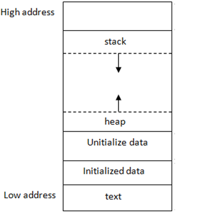

# Memory

## What is Memory

Everything is memory!!!

No seriously. The data you store in your microcontroller is memory. Your code that you put onto the microcontroller is memory. The actual logic of your code happens in memory. Basically, everything is memory. At the start I will introduce some fundamental parts of understanding memory in a firmware lens, and then talk more theory of how the memory actually works on a HW level.

If this interests you at all, you will love CS61C!

### Volatile Memory

Volatile Memory is the memory used by the code as it is running. It is a little more nuanced than that, but the idea is most of your logic and storage of data of your board is in your volatile memory. Why does this matter?

Well, volatile memory has the interesting feature of not persisting when the microcontroller turns off. So let's say for example we wanted a counter that is initialized at 0 and every second is incremented by one. If the microcontroller would lose power, then the counter would reset to 0 and start counting up again.

This is a long winded way to say: do not rely on volatile memory to store things and track things over a long period of time!!!

### Persistent Memory

Persistent Memory is memory that persists after the microcontroller turns off. Generally, the use of persistent memory must be actively chosen, so you can choose what lives here. 

The most common example of persistent memory is your flash memory. Your flash memory is where your code lives. You can imagine we need this to be persistent, as the microcontroller on restart should know the code it needs to run. Luckily for us, the ESP-IDF when we flash code (now you know why we call it flashing code) knows how to do it for us!!!

We also have EEPROM which you can look up yourself, but it is also an important persistent memory storage.

## Memory Layout

Disclaimer: now we will get into more theory that isn't as relevant to the project, but key to understanding how memory works.

### The Stack

In CS61A we learn about this idea of a stack and stack frames. This is the stack in memory! The stacks data is local to it's own stack frame, so truly local variables.

### The Heap

What if we wanted to store stuff across stack frames!!! We can then store it in the heap. The heap must be stored manually, which makes it harder, but it lets you reach across stack frames!

### The Data

The data is where your static data lives that can be edited across memory!

### The Text / Code

The code is where your code lives.

## Pointers and Misc

A pointer is a piece of memory that points at other memory. WHAT??? Basically, we have a piece of memory with data. Let's say I want to pass that data into a function. Instead of copying it in, we can instead pass in a pointer to the function. This means my function can now see the original memory as it is being pointed to.

### Lists

Lists are not magic, they are instead sequential pieces of memory that our pointers traverse to. WHAT? Okay, so a list is not magic, it's just smartly allocated memory. Actually, all objects are. 

All of our objects actuall live in the heap and have pointers to access them!

### What about IO pins

IO pins are actually parts of the computer as well. We have this notion in hardware of registers, which are small parts of memory. When we change an IO, we are literally changing data in a register.

## Conclusion

Like I said, this is not comprehensive, but I hope I gave you a taste of memory before CS61C!